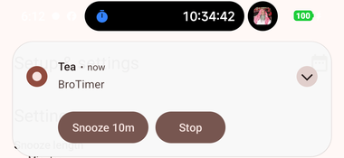

# BroTimer

An Android app for repeating reminders that ring like a **real alarm clock** — full screen, with
sound, over the lock screen, with Snooze and Stop — plus labelled stopwatches and countdown timers.

Built for a Xiaomi phone running Android 16 / HyperOS, sideloaded over USB with `adb`.

## Screenshots

Real captures from the phone it was built for.

| Interval alarms | Stopwatches | Timers | Setup |
|---|---|---|---|
|  |  |  |  |
| Each alarm shows its interval and exactly when it fires next. | Labelled, and they keep counting while the app is closed. | Labelled, and they ring like a real alarm at zero. | Settings, plus the checklist that decides whether alarms work. |

A timer going off — the alarm gives you **Snooze** and **Stop** wherever you are:



When the phone is **locked**, this takes over the whole screen instead of appearing as a banner.

## What it does

**Interval alarms.** Set one to "every 2 h 30 min" with the text you want to see, and it rings on a
**fixed grid** from the moment you switched it on. Dismissing an alarm late does not push the next
one later — 10:00, 12:30, 15:00 stay where they are. Each alarm has its own on/off switch.

**"I will sleep now."** One button pauses every interval alarm for 8 h 30 min (editable, down to
the minute). While it is asleep a banner shows when it wakes up, and a **Wake up now** button ends
it early. When sleep ends, every alarm starts a *fresh full countdown* — a 2-hour alarm rings 2
hours after you wake, not the instant sleep mode lifts. Timers and stopwatches are not affected.

**Stopwatches.** As many as you like, each with a label. They keep counting with the app closed,
swiped out of Recents, or after a reboot, because the elapsed time is derived from a stored
timestamp rather than ticked by a running service.

**Timers.** As many as you like, each with a label. When one reaches zero it rings with the same
full-screen alarm as an interval alarm.

**Sound.** The phone's own alarm ringtone by default. Each alarm and timer can pick a different
one through the standard Android ringtone chooser. Sound plays on the alarm stream, so it is
audible even on silent. An alarm nobody answers gives up after 5 minutes (editable) and carries on
with its normal schedule.

## Build and install

You need the phone plugged in over USB with USB debugging on.

```powershell
.\install.ps1
```

That builds the APK and installs it. Other options:

| Command | What it does |
|---|---|
| `.\build.ps1` | Build only. APK lands in `app\build\outputs\apk\debug\app-debug.apk` |
| `.\build.ps1 -Clean` | Wipe `app\build` first |
| `.\install.ps1 -Fresh` | Uninstall first (**deletes saved alarms**), then install |
| `.\install.ps1 -SkipBuild` | Install the APK that is already built |
| `.\install.ps1 -Launch` | Also open the app on the phone |

### Toolchain

There is no JDK, Android SDK or Gradle on this PC's `PATH`. BroTimer borrows the vendored one from
the **BroMic** project (`Desktop\bro mic\.tools\`) — JDK 17.0.12, Gradle 8.7, Android SDK with
platform `android-35` — rather than installing another ~873 MB copy. `tools.ps1` finds it
automatically.

⚠️ **If `Desktop\bro mic\.tools\` is ever moved or deleted, BroTimer stops building.** Point it at
the new location:

```powershell
$env:BROTIMER_TOOLS = "C:\path\to\.tools"
```

Or copy that `.tools` folder into this project — `.gitignore` already excludes it.

## After installing — the part that actually matters

Open the app and tap the **gear icon**. Two permissions are needed on any Android phone:

- **Notifications** — without it there is no alarm notification, so no full-screen alarm.
- **Full-screen alarms** — Android 14+ treats this as a special permission of its own.

And on Xiaomi / HyperOS, **two more must be switched on by hand**. They have no public setting an
app can open, and they are the most common reason an alarm never appears:

1. **Autostart → ON** · Settings → Apps → Manage apps → BroTimer → Autostart
2. **Display pop-up windows while running in background → ON** · same menu → Other permissions
3. **Battery saver → No restrictions** · same menu → Battery saver
4. **Lock BroTimer in Recents** · open Recents, drag the card down, tap the padlock

The Setup screen lists all of these with buttons for the ones that can be opened directly.

## If an alarm does not fire

```powershell
adb shell dumpsys alarm | Select-String brotimer     # is it actually scheduled?
adb logcat -s BroTimer:V                             # what the app did
```

## How it is built

Kotlin + Jetpack Compose, one module, no database. State is `SharedPreferences` + `org.json`, so
the app has no dependency outside the Compose/AndroidX set already cached on this machine.

Scheduling uses `AlarmManager.setAlarmClock()` for everything — interval slots, timers, snoozes and
the end of sleep mode. It is the only alarm API fully exempt from Doze *and* battery optimisation,
which is what makes alarms survive an aggressive OEM skin.

The ringing sound is owned by a foreground service, not by the alarm screen. On Android 14+ a
full-screen intent can be downgraded to a banner, in which case the screen never opens — if the
screen owned the sound, that alarm would be silent.

See [`CLAUDE.md`](CLAUDE.md) for the file map and [`docs/CHANGELOG.md`](docs/CHANGELOG.md) for the
record of what was decided and why.
