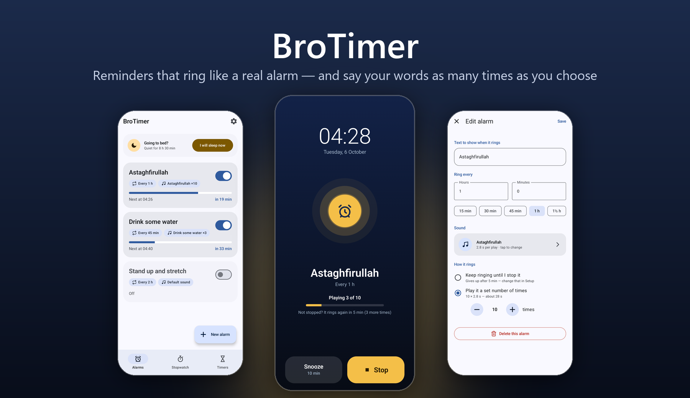
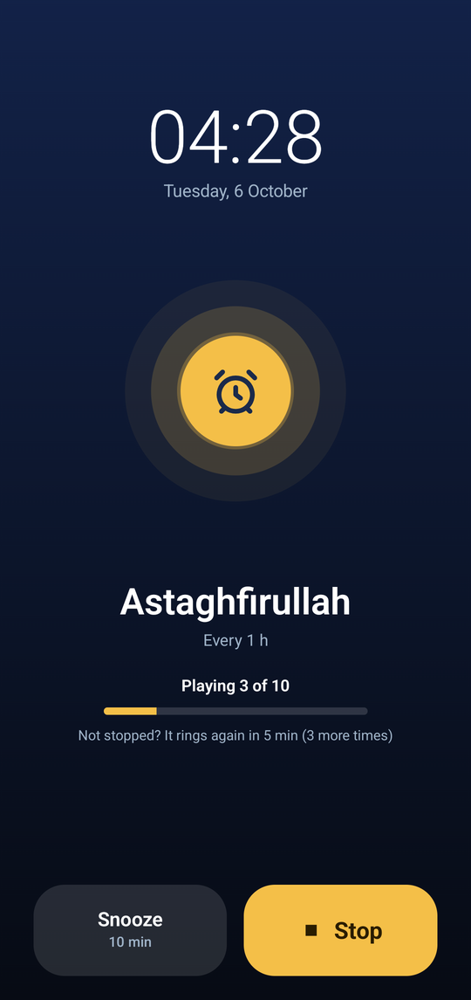
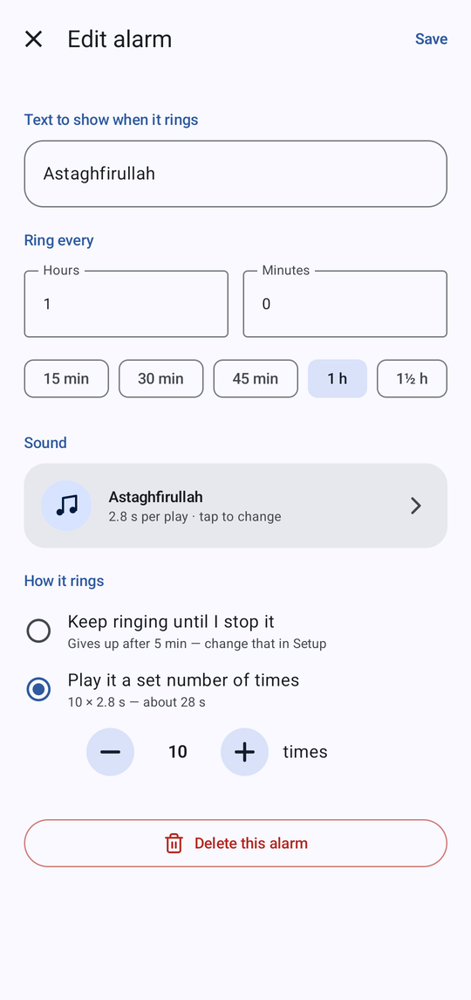
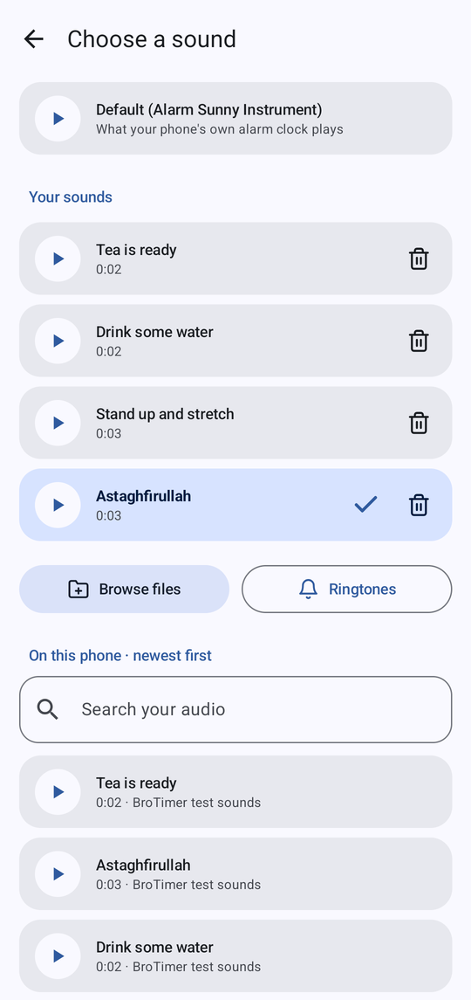
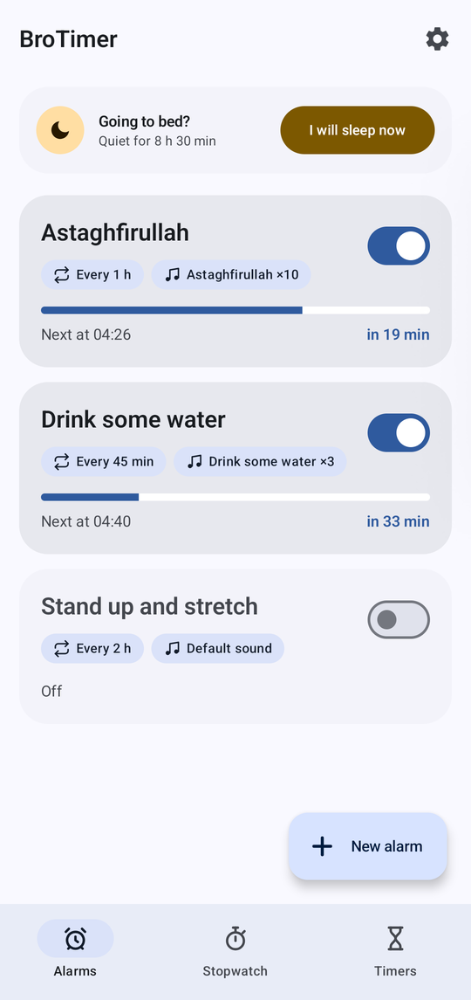
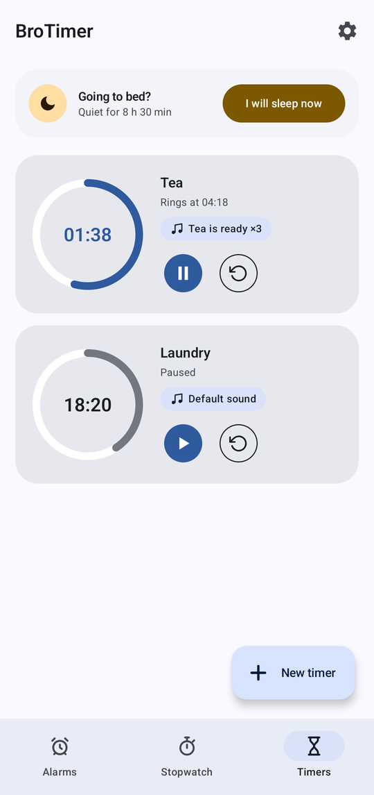
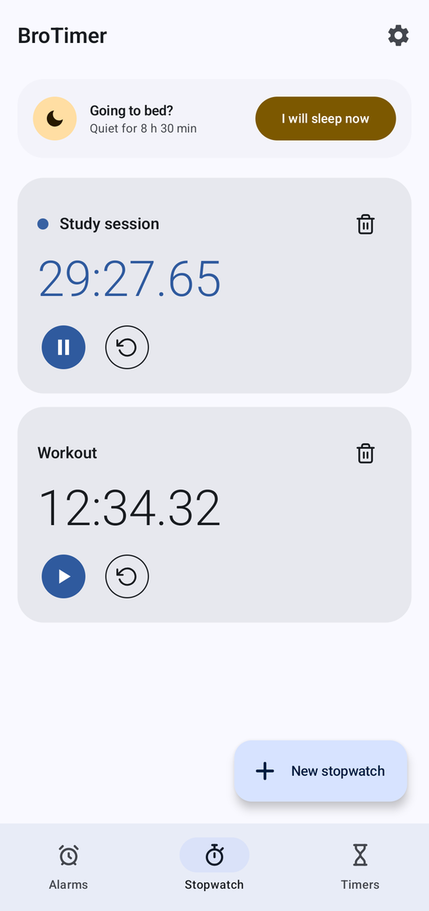
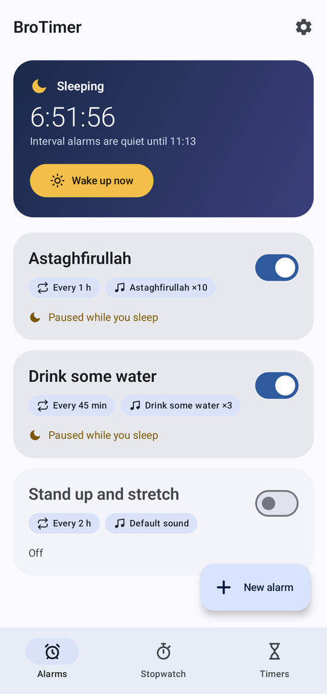
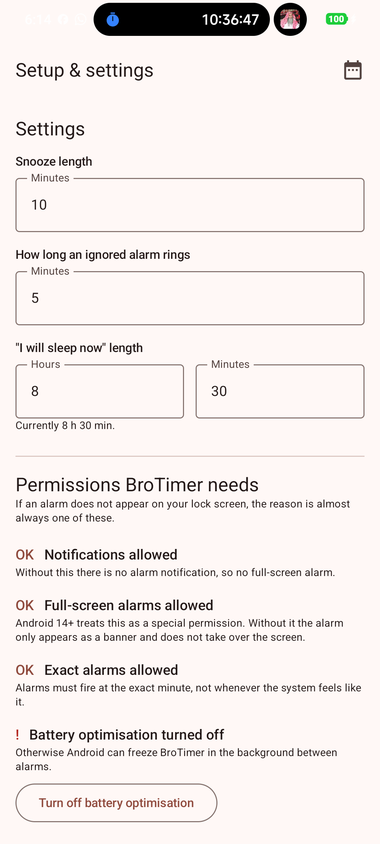
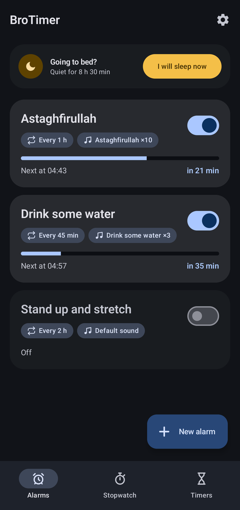

<p align="center">
  
</p>

<p align="center">
  <b>Repeating reminders that ring like a real alarm clock.</b><br>
  Full screen over the lock screen · plays your sound exactly <i>N</i> times · comes back if you miss it
</p>

<p align="center">
  
  
  
  
</p>

---

## The idea

Most phones can repeat an alarm every day. Very few can repeat one **every 45 minutes**, or every
hour and a half — and none of them can *say something* a set number of times and then stop.

BroTimer does exactly that. For example:

> **“Astaghfirullah” · every 1 hour · play it 10 times**
>
> Each hour the phone wakes up, shows the text over the lock screen, says the word ten times, and
> stops by itself. Missed it? It comes back **5 minutes later** — up to 3 times — until you press
> **Stop**.

Any short audio clip works: a word from Zedge, a voice note from WhatsApp, a recording you made.

## Features

| Feature | What it does |
|---|---|
| **Interval alarms** | Every *X* hours and minutes, each with its own text and an on/off switch. They run on a fixed grid — dismissing late never pushes the next one later. |
| **Play it *N* times** | Choose how many times the sound plays, from 1 to 99 — or keep ringing until you stop it. The editor shows the total: *10 × 2.8 s — about 28 s*. |
| **Comes back if missed** | Not stopped? It rings again after 5 minutes, up to 3 times. Both numbers are adjustable, and 0 turns it off. |
| **Your own sounds** | The sound picker lists **every audio file on the phone, newest first**, so a tone you just downloaded is the top row. Or browse files, pick a ringtone, or **Share → BroTimer** from any app. |
| **Sounds that never vanish** | Picked sounds are copied into the app, so deleting the original — or uninstalling Zedge — never silences an alarm. |
| **“I will sleep now”** | One tap pauses every interval alarm for 8 h 30 min (adjustable). On waking each alarm starts a fresh countdown, so nothing goes off the instant you wake. |
| **Stopwatches & timers** | As many as you like, each with a label. Timers ring with the same full-screen alarm, and can play a set number of times too. |
| **Your choice of feel** | Vibration on or off, snooze length, light / dark / follow-the-phone theme. |

## Screenshots

<table>
  <tr>
    <td align="center"><br><sub>Over the lock screen — no unlocking needed</sub></td>
    <td align="center"><br><sub>Every hour, play it 10 times</sub></td>
    <td align="center"><br><sub>Your sounds, and the newest audio on the phone</sub></td>
  </tr>
</table>

<details>
<summary><b>More screenshots</b> — timers, stopwatches, sleep mode, settings, dark theme</summary>
<br>
<table>
  <tr>
    <td align="center"><br><sub>Alarms, with time to the next ring</sub></td>
    <td align="center"><br><sub>Timers</sub></td>
    <td align="center"><br><sub>Stopwatches</sub></td>
  </tr>
  <tr>
    <td align="center"><br><sub>“I will sleep now”</sub></td>
    <td align="center"><br><sub>Settings and permission checks</sub></td>
    <td align="center"><br><sub>Dark theme</sub></td>
  </tr>
</table>
</details>

## Getting a sound from Zedge (or anywhere)

1. In **Zedge**, open a ringtone and download it. Any app that saves audio to the phone works the same way.
2. In BroTimer, open an alarm → **Sound**. The file you just downloaded is the first row under
   **On this phone · newest first**. Tap **▶** to listen, tap the row to use it.
3. Under **How it rings**, choose **Play it a set number of times** and set the count.

The first time, BroTimer asks to read your audio files. If you would rather not allow that,
**Browse files** and **Share → BroTimer** work without it.

## Build and install

BroTimer is built from source and installed over USB with `adb`.

```powershell
.\install.ps1        # build the APK and install it on the connected phone
```

| Command | What it does |
|---|---|
| `.\build.ps1` | Build only → `app\build\outputs\apk\debug\app-debug.apk` |
| `.\build.ps1 -Clean` | Wipe the previous build first |
| `.\install.ps1 -Fresh` | Uninstall first (**deletes saved alarms**), then install |
| `.\install.ps1 -Launch` | Also open the app afterwards |

It needs a JDK 17, Gradle 8.7 and an Android SDK with platform 35. `tools.ps1` looks for them in
`$env:BROTIMER_TOOLS`, then in `.\.tools\`. On some Xiaomi phones a normal `adb install` is refused
(`INSTALL_FAILED_USER_RESTRICTED`); `install.ps1` detects that and installs through the phone's own
shell instead.

## Make sure alarms can reach you

Open the app's **⚙ Setup**. It checks the four permissions every Android phone needs —
notifications, full-screen alarms, exact alarms, no battery optimisation — and opens the right
screen for any that are missing.

**On Xiaomi / HyperOS** a few more live in the phone's own settings, where no app is allowed to
change them. Setup lists them with their exact menu paths:

- **Autostart** → on
- **Other permissions → Show on lock screen** → allow
- **Other permissions → Display pop-up windows while running in background** → allow
- **Battery saver** → no restrictions

## How it works

- **`AlarmManager.setAlarmClock()` for everything** — the only Android alarm that both Doze and
  battery optimisation leave alone. Measured on a Xiaomi running Android 16: rings land within a
  few milliseconds of their scheduled time.
- **The sound lives in a foreground service, not in the alarm screen.** Android may show an alarm as
  a banner instead of a full screen (always, while the phone is unlocked and in use); the alarm must
  still be heard.
- **Counting plays.** Ordinary audio files report when each play finishes. Some built-in phone tones
  loop by themselves and never do, so BroTimer also watches the playback position jump back to the
  start — both paths are tested on a real phone.
- **No database, no network, no tracking.** Settings live in `SharedPreferences`; the app has no
  internet permission at all.

Kotlin · Jetpack Compose · Material 3 · single module · no third-party libraries beyond AndroidX.
The full design record — every decision and why — is in [`docs/CHANGELOG.md`](docs/CHANGELOG.md).
